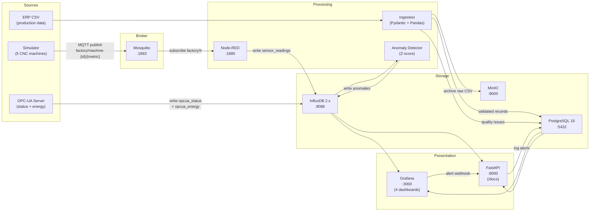

# Industrial IoT Data Pipeline

A fully containerized Industrial IoT data pipeline that simulates factory sensor data, ingests it via MQTT and OPC-UA, validates and stores it in InfluxDB + PostgreSQL, visualizes it in Grafana with alerting, and exposes processed data via FastAPI.

**Everything runs with one command:** `docker compose up -d`

---

## Architecture



## Tech Stack

| Component | Technology | Purpose |
|-----------|-----------|---------|
| Sensor Simulation | Python + paho-mqtt 2.x | Publishes temperature, RPM, pressure for 5 machines every 1-2s |
| Message Broker | Eclipse Mosquitto 2 | MQTT broker with anonymous local access |
| Flow Processing | Node-RED + influxdb contrib | Bridges MQTT → InfluxDB with JSON transform |
| Time-Series DB | InfluxDB 2.x (Flux) | Stores sensor readings, OPC-UA data, anomalies |
| Industrial Protocol | OPC-UA via asyncua | Exposes machine status (Running/Idle/Fault) + energy on port 4840 |
| Relational DB | PostgreSQL 16 | Machine registry, alerts, ERP data, quality logs |
| Object Storage | MinIO (S3-compatible) | Archives raw CSV files |
| Data Validation | Pydantic v2 + Pandas | Range checks, duplicate detection, missing value flagging |
| Anomaly Detection | Python (NumPy Z-score) | Flags readings with \|Z\| > 3.0 every 60 seconds |
| Visualization | Grafana OSS (file-provisioned) | 4 dashboards with thresholds + 4 alert rules |
| REST API | FastAPI + Uvicorn | 6 endpoints: machines, readings, alerts, health, Grafana webhook |
| Orchestration | Docker Compose | 11 services on shared network with health checks |

## Prerequisites

- **Docker Desktop** (includes Docker Engine + Compose): https://www.docker.com/products/docker-desktop/
- No other software required — all dependencies are containerized

## Quick Start

```bash
# 1. Clone the repo
git clone <repository-url>
cd industrial-iot-data-pipeline

# 2. Create environment file and set your passwords
cp .env.example .env
# Edit .env — replace every CHANGE_ME value with a strong password/token
# Tip: generate random tokens with:  openssl rand -hex 16

# 3. Start all 11 services
docker compose up -d --build

# 4. Verify everything is healthy
docker compose ps

# 5. Open the dashboards (use the passwords you set in .env)
# Grafana:  http://localhost:3000
# InfluxDB: http://localhost:8086
# FastAPI:  http://localhost:8000/docs
# Node-RED: http://localhost:1880
# MinIO:    http://localhost:9002
```

> **Security**: The pipeline will refuse to start if any required secret is missing from `.env`.
> All passwords and tokens are read exclusively from your `.env` file — nothing is hardcoded.

## Services

| Service | Port | URL | Login |
|---------|------|-----|-------|
| Mosquitto (MQTT) | 1883, 9001 | mqtt://localhost:1883 | anonymous |
| InfluxDB | 8086 | http://localhost:8086 | *see .env* |
| PostgreSQL | 5432 | postgres://localhost:5432/iot_pipeline | *see .env* |
| MinIO Console | 9000, 9002 | http://localhost:9002 | *see .env* |
| Grafana | 3000 | http://localhost:3000 | *see .env* |
| Node-RED | 1880 | http://localhost:1880 | (none) |
| OPC-UA Server | 4840 | opc.tcp://localhost:4840 | — |
| FastAPI | 8000 | http://localhost:8000/docs | (none) |
| Simulator | — | (internal) | — |
| Anomaly Detector | — | (internal) | — |
| ERP Ingestion | — | (internal) | — |

## Data Flow

1. **Simulator** publishes JSON sensor readings (temperature, RPM, pressure) to MQTT topics `factory/machine-{1-5}/{metric}` every 1-2 seconds. ~5% of readings are anomalous.
2. **Node-RED** subscribes to `factory/#`, transforms messages, and writes to InfluxDB measurement `sensor_readings`.
3. **OPC-UA Server** exposes machine status (Running/Idle/Fault) and energy consumption via OPC-UA protocol on port 4840, and writes `opcua_status` + `opcua_energy` to InfluxDB every 5s.
4. **ERP Ingestion** reads a bundled CSV, validates with Pydantic, detects quality issues (missing values, duplicates, out-of-range), writes clean records to PostgreSQL `erp_data`, archives raw CSV to MinIO, and logs issues to `data_quality_log`.
5. **Anomaly Detector** queries the last 10 minutes of sensor data from InfluxDB every 60s, computes Z-scores per machine/metric, and writes flagged anomalies (|Z| > 3) back to InfluxDB `anomalies` measurement.
6. **Grafana** displays 4 auto-provisioned dashboards (Live Readings, Historical Trends, Machine Overview, Alerts History) and fires alert webhooks to FastAPI when thresholds are breached.
7. **FastAPI** provides REST endpoints for machines, readings, alerts, and receives Grafana alert webhooks, logging them to PostgreSQL `alerts` table.

## Grafana Dashboards

| Dashboard | Panels | Datasource |
|-----------|--------|------------|
| **Live Sensor Readings** | Time-series (temp, RPM, pressure) + gauges | InfluxDB |
| **Historical Trends** | Selectable time range, machine filter, comparison bars | InfluxDB |
| **Machine Overview** | Machine registry, latest readings, OPC-UA status, quality summary | InfluxDB + PostgreSQL |
| **Alerts History** | Active alerts, all alerts (24h), severity pie chart, anomaly Z-scores | PostgreSQL + InfluxDB |

## Alert Rules

| Rule | Condition | Severity |
|------|-----------|----------|
| Temperature Warning | > 85°C | warning |
| Temperature Critical | > 95°C | critical |
| RPM Out of Range | < 1000 or > 2000 | warning |
| Pressure High | > 4.0 bar | warning |

Alerts fire a webhook to `POST /webhooks/grafana-alert` which logs to the PostgreSQL `alerts` table.

## API Endpoints

| Method | Path | Description |
|--------|------|-------------|
| GET | `/health` | Health check (InfluxDB + PostgreSQL status) |
| GET | `/machines` | List all machines from PostgreSQL |
| GET | `/machines/{id}/readings?last=1h` | Recent readings from InfluxDB |
| GET | `/machines/{id}/alerts` | Alert history for a machine |
| POST | `/alerts/acknowledge/{id}` | Acknowledge an active alert |
| POST | `/webhooks/grafana-alert` | Receive Grafana alert webhook |

Interactive Swagger docs: http://localhost:8000/docs

## PostgreSQL Schema

| Table | Purpose |
|-------|---------|
| `machines` | Device registry (5 seeded CNC machines) |
| `alerts` | Alert log with severity + acknowledgement tracking |
| `erp_data` | Ingested ERP production records |
| `data_quality_log` | Quality issues (duplicates, missing values, range errors) |

## Project Structure

```
├── docker-compose.yml            # 11 services, networking, volumes, health checks
├── docker-compose.override.yml   # Dev hot-reload overrides
├── .env.example                  # All configurable environment variables
├── simulator/                    # MQTT sensor publisher (paho-mqtt)
│   └── simulator.py
├── opcua_server/                 # OPC-UA server + client (asyncua)
│   └── server.py
├── ingestion/                    # ERP CSV ingest + validation
│   ├── erp_ingest.py             # Pandas CSV reader → PostgreSQL + MinIO
│   ├── models.py                 # Pydantic v2 models (SensorReading, ERPRecord)
│   ├── quality.py                # Quality checks (duplicates, missing, range)
│   └── data/factory_erp.csv      # Bundled mock ERP data
├── anomaly/                      # Z-score anomaly detector
│   └── detector.py
├── api/                          # FastAPI REST backend
│   └── main.py
├── grafana/provisioning/
│   ├── datasources/datasources.yml
│   ├── dashboards/               # 4 dashboard JSON files + provisioning YAML
│   └── alerting/alerting.yml     # 4 alert rules + webhook contact point
├── nodered/                      # Node-RED MQTT → InfluxDB flow
│   ├── flows.json
│   ├── entrypoint.sh
│   └── settings.js
├── mosquitto/
│   └── mosquitto.conf
├── db/
│   └── init.sql                  # PostgreSQL schema (4 tables + seed data)
└── docs/
    └── README.md
```

## Common Commands

```bash
# Start all services
docker compose up -d --build

# Check status
docker compose ps

# View logs (all / specific service)
docker compose logs -f
docker compose logs -f simulator

# Stop all services (keep data)
docker compose down

# Stop and delete all data (fresh start)
docker compose down -v

# Rebuild one service after code change
docker compose up -d --build api

# Dev mode with hot-reload
docker compose -f docker-compose.yml -f docker-compose.override.yml up -d --build
```

## Verification Checklist

- [ ] `docker compose ps` — all 11 services healthy
- [ ] InfluxDB Data Explorer → `sensor_readings` shows data for all 5 machines
- [ ] Node-RED (localhost:1880) → flow active with message counts
- [ ] PostgreSQL → `SELECT count(*) FROM machines` returns 5
- [ ] PostgreSQL → `erp_data` has ingested rows after 5 minutes
- [ ] MinIO Console → bucket `raw-data` shows archived CSV files
- [ ] Grafana → all 4 dashboards load with live data
- [ ] FastAPI Swagger → all endpoints return valid responses
- [ ] Anomaly detector logs show periodic runs
- [ ] After `docker compose down -v && docker compose up -d` — everything recovers
